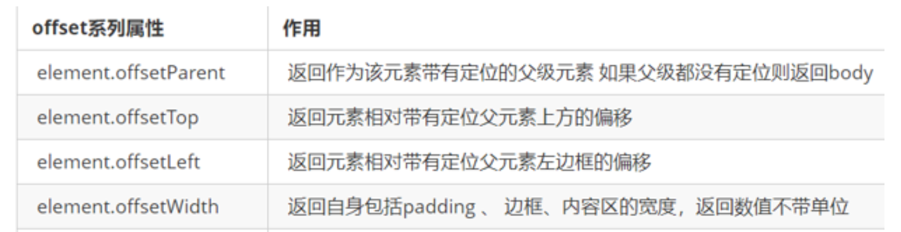
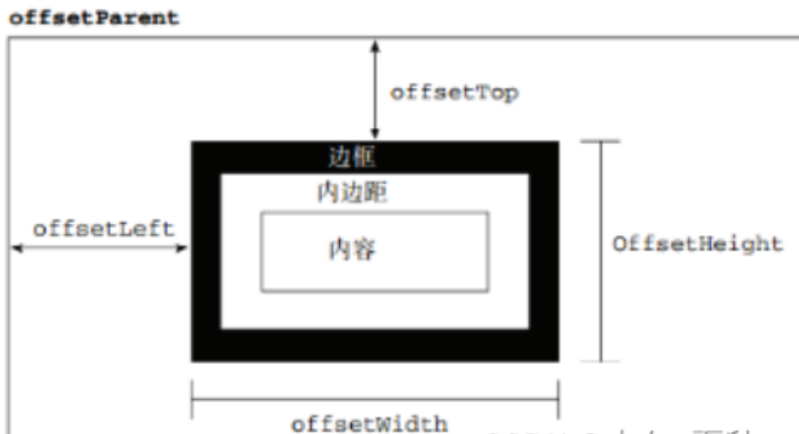
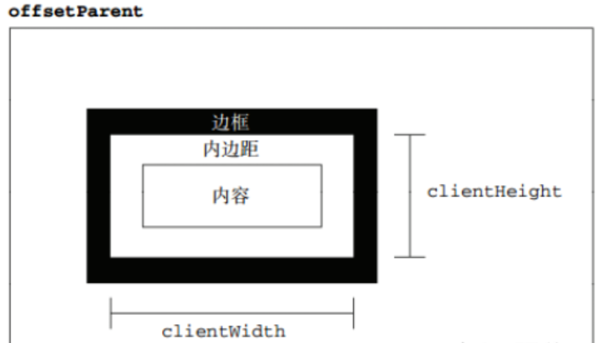
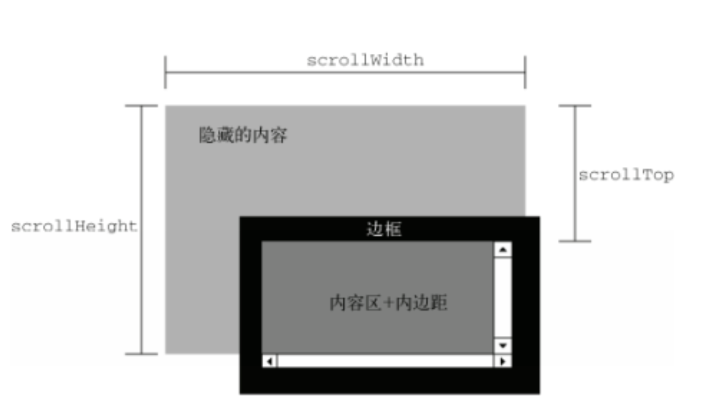
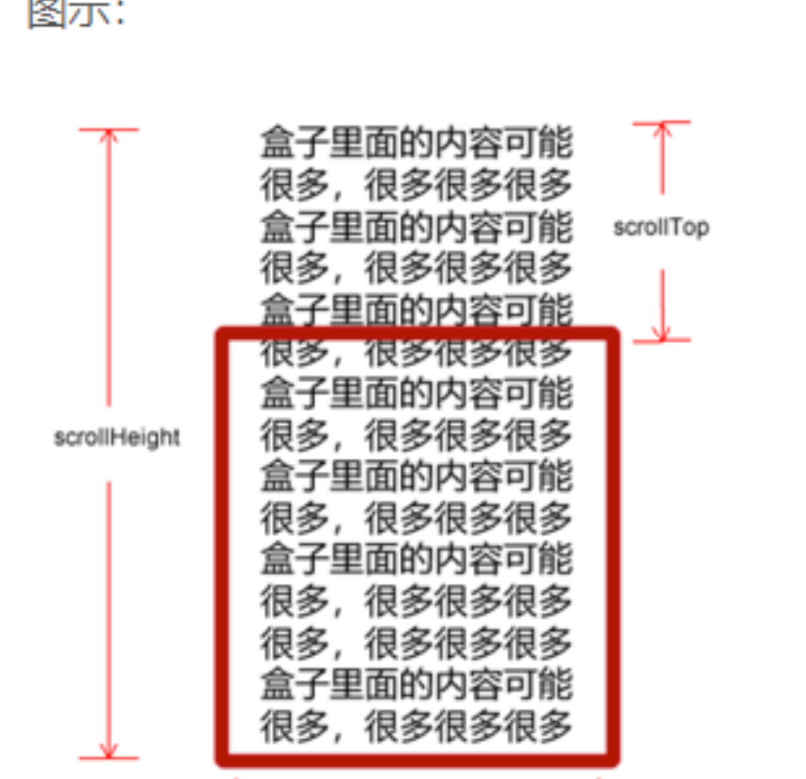

三大系列简介：
=======

1、用法介绍： 
--------

> *   offset系列 经常用于获得元素位置    offsetLeft  offsetTop。
> *   client经常用于获取元素大小  clientWidth clientHeight。
> *   scroll 经常用于获取滚动距离 scrollTop  scrollLeft  。
> *   注意页面滚动的距离通过 window.pageXOffset  获得。

2、类型介绍：
-------

<table align="center" border="1" cellpadding="1" cellspacing="1" style="width:500px;"><tbody><tr><td>offset</td><td>scroll</td><td>client</td></tr><tr><td>offsetWidth&nbsp;&nbsp;</td><td>&nbsp; scrollWidth&nbsp;</td><td>clientWidth</td></tr><tr><td>offsetHeight</td><td>scrollHeight&nbsp;</td><td>clientHeight</td></tr><tr><td>offsetLeft</td><td>scrollLeft&nbsp;&nbsp;</td><td>&nbsp;clientLeft</td></tr><tr><td>offsetTop</td><td>scrollTop</td><td>&nbsp;clientTop</td></tr><tr><td>offsetParent</td><td>-</td><td>-</td></tr></tbody></table>

一、元素偏移量offset系列 
================

> offset 翻译过来就是偏移量， 我们使用 offset系列相关属性可以动态的得到该元素的位置（偏移）、大小等。

 1、属性介绍：
--------

 2、图示：
---------------------------------------------------------------------------

 

3、代码示例：
-------

```
 <style>
        * {
            margin: 0;
            padding: 0;
        }
        
        .father {
            position: relative;
            width: 200px;
            height: 200px;
            background-color: pink;
            margin: 150px 100px;
        }
        
        .son {
            width: 100px;
            height: 100px;
            background-color: purple;
            margin-left: 45px;
        }
        
        .w {
            width: 200px;
            height: 200px;
            background-color: skyblue;
            margin: 0 auto 200px;
            padding: 10px 20px;
            border: 15px solid red;
        }
</style>
 
    <div class="father">
        <div class="son"></div>
    </div>
    <div class="w"></div>
```
```
<script>
        var father = document.querySelector('.father');
        var son = document.querySelector('.son');
        console.log(father.offsetTop);
        console.log(father.offsetLeft);
        console.log('---------------');
        console.log(son.offsetLeft);
        console.log(son.offsetTop);
        console.log('---------------');
        var w = document.querySelector('.w');
        console.log(w.offsetWidth);
        console.log(w.offsetHeight);
</script>
```

4、输出结果：
-------

 

> *   1、返回body上方的偏移； 150就等于margin: 150px；输出数值不带单位；
> *   2、返回body左边框的偏移； 100就是等于margin: 100px；不带单位；
> *   3、返回元素相对带有定位父元素上方的偏移；45就是等于margin-left: 45px;不带单位；
> *   4、返回元素相对带有定位父元素左边框的偏移；0就是等于margin: 0；不带单位；
> *   5、返回自身包括padding、边框、内容区的宽度；270等于width: 200px+padding: 20px+padding: 20px+border: 15px+border: 15px；
> *   6、返回自身包括padding、边框、内容区的高度；250等于width: 200px+padding: 10px+padding: 10px+border: 15px+border: 15px；

二、元素可视区client系列
===============

> client 翻译过来就是客户端，我们使用 client 系列的相关属性来获取元素可视区的相关信息。通过 client系列的相关属性可以动态的得到该元素的边框大小、元素大小等。

1、属性介绍 
-------



2、图示：
-----



3、代码示例
------

```
<style>
        div {
            width: 200px;
            height: 200px;
            background-color: pink;
            border-top: 10px solid red;
            border-left: 20px solid red;
            padding: 10px 30px;
        }
</style>
    <div></div>
```
```
<script>
        var div = document.querySelector('div');
        console.log(div.clientWidth);
        console.log(div.clientHeight);
        console.log(div.clientLeft);
        console.log(div.clientTop);
</script>
```

4、效果： 
------




> *   1、 返回自身包括padding、内容区的宽度、不含边框，返回数值不带单位；260就是等于width:200px+padding: 30px+padding: 30px；
> *   2、返回自身包括padding、内容区的高度、不含边框，返回数值不带单位；220就是等于width:200px+padding: 10px+padding: 10px；
> *   3、返回元素左边框的大小；20就是等于border-left: 20px；
> *   4、返回元素上边框的大小；10就是等于border-top: 10px；

三、元素滚动[scroll](https://so.csdn.net/so/search?q=scroll&spm=1001.2101.3001.7020 "scroll")系列
=========================================================================================

> scroll 翻译过来就是滚动的，我们使用 scroll 系列的相关属性可以动态的得到该元素的大小、滚动距离等。

1、属性介绍
------




2、图示
----




3、代码
----

```
<script type="text/javascript"> 
var dome=document.getElementById("dome"); //获取节点 
var dome1=document.getElementById("dome1"); 
var dome2=document.getElementById("dome2"); 
var speed=50;//设置向上轮动的速度 
dome2.innerHTML=dome1.innerHTML;//复制节点 关键语句 
function moveTop(){ 
if(dome1.offsetHeight-dome.scrollTop<=0){//判断内容第一次是否循环完了 
dome.scrollTop=0; 
}else{ 
dome.scrollTop++;//否则上移 
} 
} 
var myFunction=setInterval("moveTop()",speed);//设置时间定时 
dome.οnmοuseοver=function(){//鼠标放在区域内停止 
clearInterval(myFunction); 
} 
dome.οnmοuseοut=function(){ 
myFunction=setInterval(moveTop,speed); 
} 
</script> 
```

4、效果
----


