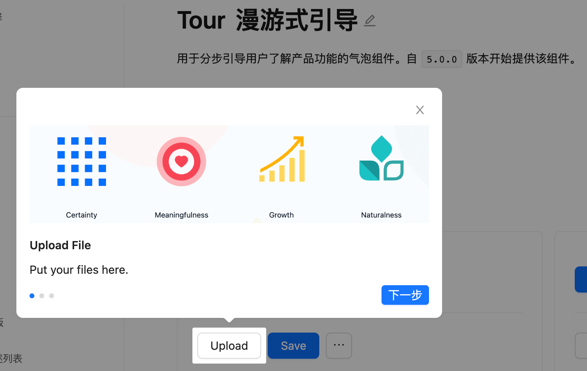

## 需求
目前很多组件库都有类似的《Tour漫游式引导》组件，例如`ant design `的最新5版本也提供了该组件，但是为什么我还要自己封装一套呢？

因为一个大型项目需要引导的步骤可能**很多很乱**，并且对于某个步骤可能会**在多个页面出现**，并且我们公司作为一个`UI在线设计平台`为了让用户上手更容易些也要在不同的页面使用各种漫游式引导。
所以我打算**手动封装**一个～
## 实现
### UI实现
首先肯定是`UI`部分的实现～，为了方便后续的**管理和使用**，这里把每个引导的结构封装成**配置**，里面包含了每个引导项的各种`DOM`信息
```tsx
// 63. 钢笔工具
const PENTOOL: any = {
  type: 'penTool',
  title: '钢笔工具',
  desc: (color: string) => {
    return `使用<span style="color: ${color}">锚点</span>和<span style="color: ${color}">贝塞尔曲线</span>，你可以轻松地绘制出规整的曲线和直线路径，实现高效自由的设计。`
  },
  direct: 'left',
  vertical: 'top',
  domId: 'penToolProcess',
  hasImg: true,
  videoSrc: `${(window as any).jsStaticUrl}/assets/Resources/guide/mp4/penTool.mp4`,
  height: 444,
  width: 360,
  videoHeight: 240
}
// 64. 云端保存
const CLOUDSTORAGE: any = {
  type: 'cloudStorage',
  title: '云端保存',
  desc: (color: string) => {
    return `文件<span style="color: ${color}">自动保存</span>在云端并<span style="color: ${color}">实时更新</span>，随时随地展开创作和调整。`
  },
  direct: 'right',
  vertical: 'top',
  domId: 'shareCooperativeProcess',
  hasImg: true,
  imgSrc: `${(window as any).jsStaticUrl}/assets/Resources/guide/img/cloudStorage.png`,
  height: 444,
  width: 360,
  videoHeight: 240
}
```
### 获取引导项对应和位置
上一步完成了对引导项的结构配置，那么如何设置每个引导项的样式和在**页面的位置**呢？
主要是通过下面封装的一个工具函数和一个自定义`hooks`
`getDomPosition`函数是用来获取元素在页面中对应的位置，它会接收前面封装的漫游项`DOM`信息，然后根据`ID`找到
页面中对应的需要引导标签的`DOM`将该引导项定位到其旁边
```tsx
// 获取对应 dom 的位置
const getDomPosition = (guideData: any) => {
  let thisPos: any;

  if (guideData) {
    let thisId: string = guideData.domId;
    if (thisId) {
      const thisDom = $(`#${thisId}`);

      if (thisDom && thisDom.length > 0) {
        thisPos = thisDom.offset();
        // 增加 right 和 bottom 的信息
        thisPos.right = window.innerWidth - thisPos.left - thisPos.width;
        thisPos.bottom = window.innerHeight - thisPos.top - thisPos.height;
      } else if (guideData.type === 'changePage') {
        const thisDom = $(`div[data-id="${thisId}"]`)[0];
        thisPos = thisDom && thisDom.getBoundingClientRect();
      } else {
        // 兜底方案，若找不到dom，定位到页面的左上角
        thisPos = {
          left: 0,
          top: 0,
          width: 48,
          height: 48
        };
      }
    }

    // 导出图片的处理，当导出的dom不在视野范围内，要向下滚动
    if (thisId == 'exportProcess' && thisPos.top > (window as any).innerHeight) {
      const rightPanelMode: string = ProtoFuncPanelStore.getRightPanelMode();
      $(rightPanelMode == 'design' ? '#editRightPanel' : '#markAttributeListPanel').scrollTop(
        100000
      );
      exportImageHasChanged = true;
      const guideDom: any = $(`#${thisId}`);

      if (guideDom && guideDom.length > 0) {
        thisPos = guideDom.offset();
        // 增加 right 和 bottom 的信息
        thisPos.right = window.innerWidth - thisPos.left - thisPos.width;
        thisPos.bottom = window.innerHeight - thisPos.top - thisPos.height;
      }
    } else {
      exportImageHasChanged = false;
    }
  }

  return thisPos;
};
```
### 设置引导项对应位置和样式
下面的`useStyleHook`钩子主要就是给对应的引导项设置样式，并且要对引导项**超出窗口的情况做出对应的处理**
```tsx
const useStyleHook = () => {
  const [guideStyle, setStyle] = useState({} as any);
  
  // 通过引导数据和索引dom来确定卡片的位置和样式
  const getGuideProcessCardPos = (guideData: any, domPos: any) => {
    let posStyle: any = {};
    let blinkerStyle: any = {};
    if (guideData && domPos) {
      // 导出图片超出窗口外的处理
      let thisId: string = guideData.domId;
      if (guideData.direct === 'left') {
        let newLeft = domPos.width / 2 - blinkerWAndH / 2 + domPos.left;
        let newTop, newBottom;
        if (guideData.vertical === 'top') {
          newTop = domPos.height / 2 - blinkerWAndH / 2 + domPos.top;
          posStyle = {
            top: newTop
          };
        } else if (guideData.vertical === 'bottom') {
          newBottom = domPos.height / 2 - blinkerWAndH / 2 + domPos.bottom;
          newTop = window.innerHeight - newBottom - guideData.height;
          posStyle = {
            top: newTop + guideData.height - blinkerWAndH
          };
        }
        posStyle = {
          ...posStyle,
          left: newLeft,
          flexFlow: 'row'
        };
      } else if (guideData.direct === 'right') {
        let newRight = domPos.width / 2 - blinkerWAndH / 2 + domPos.right;
        let newLeft = window.innerWidth - newRight - guideData.width;
        let newTop, newBottom;
        if (guideData.vertical === 'top') {
          newTop = domPos.height / 2 - blinkerWAndH / 2 + domPos.top;
          posStyle = {
            top: newTop
          };
        } else if (guideData.vertical === 'bottom') {
          newBottom = domPos.height / 2 - blinkerWAndH / 2 + domPos.bottom;
          newTop = window.innerHeight - newBottom - guideData.height;
          posStyle = {
            top: newTop + guideData.height - blinkerWAndH
          };
        }
        posStyle = {
          ...posStyle,
          left: newLeft + guideData.width - blinkerWAndH,
          flexFlow: 'row-reverse'
        };
      }

      if (guideData.vertical === 'top') {
        blinkerStyle = {
          alignSelf: 'flex-start'
        };
      } else {
        blinkerStyle = {
          alignSelf: 'flex-end'
        };
      }

    } 
    return {
      posStyle,
      blinkerStyle
    };
  };

  const setGuideStyle = (guideData: any, domPos: any) => {
    const { posStyle: CardPosStyle, blinkerStyle } = getGuideProcessCardPos(
      guideData,
      domPos
    );
    setStyle({
      CardPosStyle,
      blinkerStyle,
    });
  };

  return [guideStyle, setGuideStyle];
};
```
### 功能实现
很简单，这里主要是在`Store`中保存了引导项的`guideIndex`，在组件内通过`index`来判断需要展示哪一个引导项，点击下一步或者需要回到任意步只需要更改`Store`对应的`guideIndex`即可，项目中的`Store`是公司CEO封装的就不展示啦～